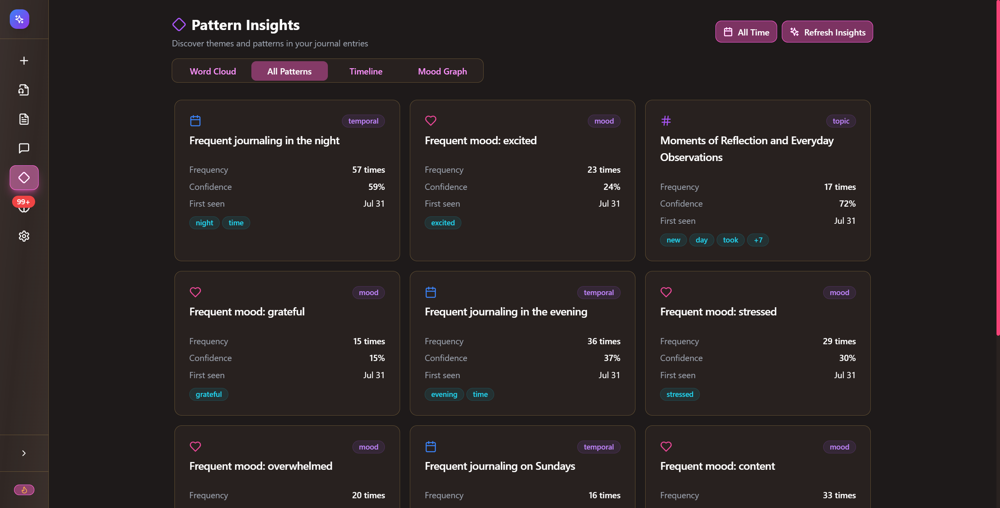
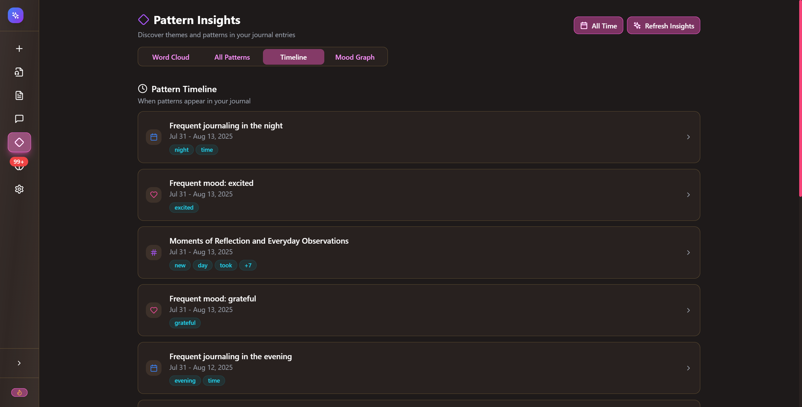
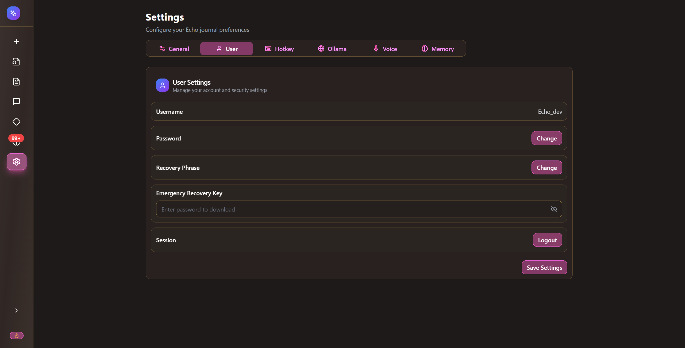
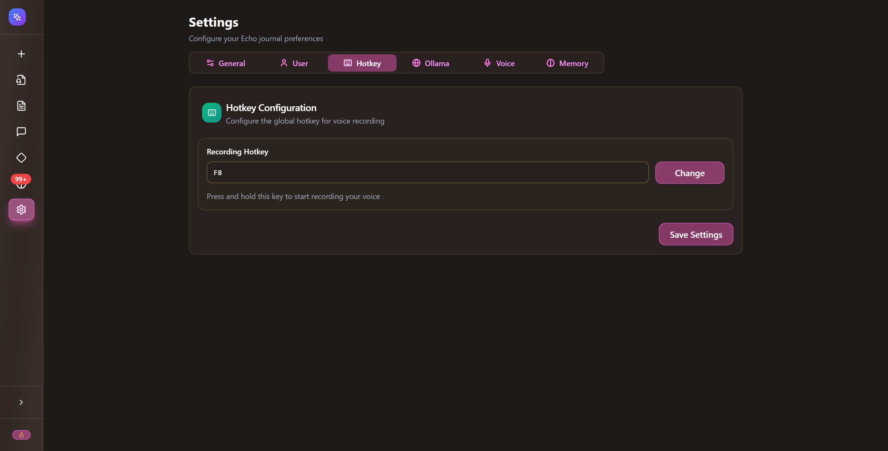
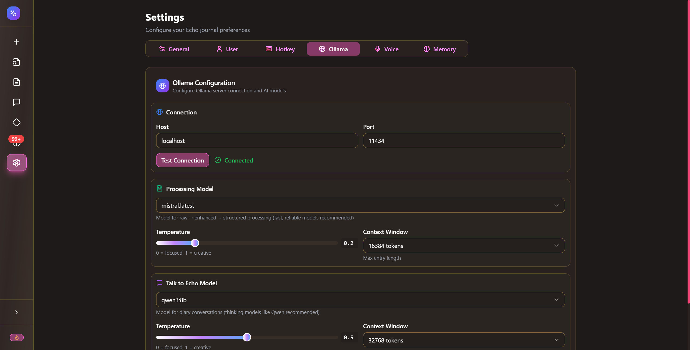
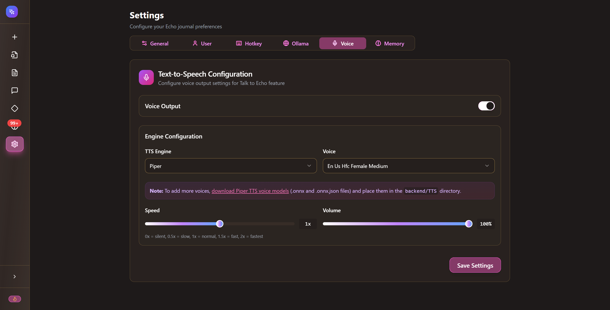
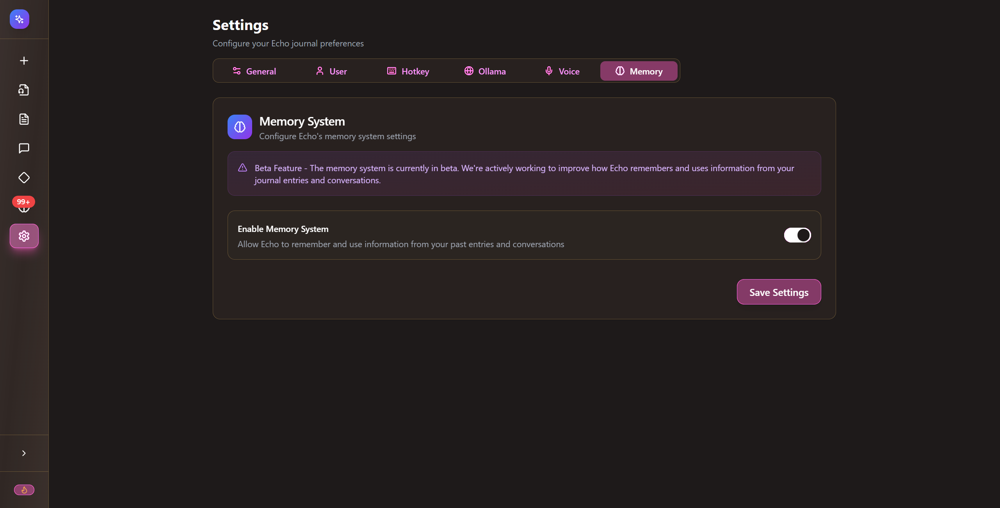
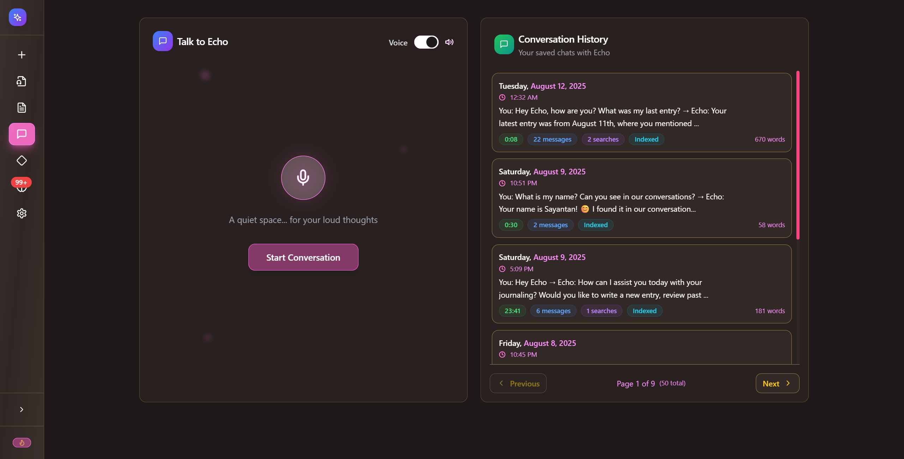

# Boo Journal Platform Walkthrough

## Overview
Boo Journal is a 100% local, private journaling application with AI-powered features for processing and analyzing your thoughts. This document provides a complete walkthrough of the platform's features and functionality.

---

## 1. Landing Page

*The main landing page of Boo Journal with Sign In and Create Account options*

### Features:
- **Boo Logo:** Beautiful gradient mountain landscape design
- **Sign In Button:** Access for existing users
- **Create Account Button:** Register new users
- **Tagline:** "100% Local, 100% Private, 100% Yours"
- **Dynamic Time Display:** Shows current time with inspirational quotes
- **Animated Background:** Starry night sky with subtle animations

---

## 2. Sign In Process

### Step 1: Access Sign In Modal
From the landing page, click on the **Sign In** button to open the authentication modal.

*The sign-in modal showing authentication options: Password, Recovery Phrase, and Emergency Key*

### Step 2: Enter Credentials
- Enter the username: **Boo_dev**
- Enter the password: **History@18**
- Click **Sign In**

### Step 3: Wait for Redirection
After successful authentication, you'll see a welcome message and be automatically redirected to the home screen.

---

## 3. Home Dashboard

*The main dashboard showing welcome message and processing options*

### Key Elements:
- **Welcome Message:** Personalized greeting with username
- **Navigation Panel:** Located on the left side with quick access to all features
- **Processing Options:** Three main processing styles displayed as cards:
  - Raw Transcription
  - Enhanced Style
  - Structured Summary
- **Statistics:** Shows your longest reflection word count
- **Current Time:** Displayed in the top right corner
- **Logout Button:** Located in the top left corner

---

## 4. Creating a New Entry

### Step 1: Navigate to New Entry
Click on **New Entry** in the left navigation panel.

### Step 2: Type Your Entry
Enter your journal entry in the text area. The interface shows:
- Word count at the bottom
- Auto-save indicator (when enabled)
- Clear All and Save Draft options

*The new entry page with a demo entry typed in the text area*

### Step 3: Process Entry
Click the **Process Entries** button at the bottom right to analyze your text.

### Step 4: Review Results
After processing, you'll see three versions of your entry:
- **Raw Transcription:** Your exact words
- **Enhanced Style:** Improved grammar and tone
- **Structured Summary:** Organized key points

### Step 5: Add to Diary
Click **Add to Boo** to save your entry. You'll receive a confirmation toast notification.

---

## 5. View Entries

*The entries page showing list of entries on the left and detailed view on the right*

### Features:
- **Entry List:** All entries displayed chronologically on the left
- **Entry Details:** Click any entry to view full content on the right
- **View Options:** Toggle between Raw, Enhanced, and Structured formats
- **Entry Metadata:** Shows date, time, word count, and mood tags
- **Search Function:** Search through your entries
- **Pagination:** Navigate through multiple pages of entries

---

## 6. Voice Upload

*The voice upload interface for transcribing offline recordings*

### How to Use:
1. Click **Choose File** or drag and drop audio files
2. Supported formats: .wav, .mp3, .m4a, .aac, .ogg, .flac, .webm
3. Maximum file size: 100MB
4. Files are processed and transcribed automatically

---

## 7. Pattern Insights

### Word Cloud View

*Interactive word cloud showing frequently used words in your journal*

### All Patterns View

*Detailed view of all identified patterns with frequency and confidence metrics*

### Timeline View

*Chronological view showing when patterns appear in your journal*

### Mood Graph View

*Visual representation of mood patterns over time with analytics*

### Features:
- **Pattern Types:** Topic, Mood, Temporal, and Behavioral patterns
- **Frequency Analysis:** Shows how often patterns occur
- **Confidence Scores:** Indicates pattern strength
- **Time Range Filter:** View patterns for specific periods
- **Refresh Insights:** Update pattern analysis

---

## 8. Settings

### General Settings

*Configure auto-save and theme preferences*

### User Settings

*Manage account details, password, and recovery options*

### Hotkey Configuration

*Configure the global hotkey for voice recording (default: F8)*

### Ollama Configuration

*Configure AI model settings for processing and conversations*

### Voice Settings

*Configure text-to-speech settings for Talk to Boo feature*

### Memory Settings

*Enable/disable the memory system (Beta feature)*

---

## 9. Memory Review

*Interface for rating memories to help Boo learn your preferences*

### Features:
- **Memory Cards:** Swipe or click to rate relevance
- **Memory Collection:** View all stored memories
- **Rating System:** Mark memories as Relevant or Irrelevant
- **Statistics:** Track reviewed vs pending memories
- **Memory Types:** Factual, Behavioral, Relational, and Preference memories

---

## 10. Talk to Boo

### Conversation List

*Main Talk to Boo interface showing conversation history*

### Active Conversation

*Active chat with Boo showing AI responses about your journal entries*

### Features:
- **Voice Toggle:** Enable/disable voice output
- **Start Conversation:** Begin new chat session
- **Conversation History:** View all past conversations
- **Message Input:** Type or use voice (hold F8)
- **AI Responses:** Boo provides insights about your entries
- **Export/Delete:** Manage individual conversations

### How to Use:
1. Click **Start Conversation**
2. Type your message or hold F8 to record
3. Boo will respond with insights from your journal
4. Toggle voice to hear responses spoken aloud

---

## Navigation Overview

### Left Sidebar Icons:
- 🏠 **Home:** Return to dashboard
- ➕ **New Entry:** Create journal entries
- 🎤 **Voice Upload:** Upload audio files
- 📄 **Entries:** View all entries
- 💬 **Talk to Boo:** Chat with AI
- 🔍 **Patterns:** Analyze journal patterns
- 🧠 **Memory Review:** Rate memories (99+ indicator shows pending)
- ⚙️ **Settings:** Configure preferences

### Additional Features:
- **Plus Button (+):** Quick action button in bottom right
- **Logout:** Top corner logout option
- **Theme:** Dark mode interface throughout
- **Notifications:** Toast notifications for actions
- **Keyboard Shortcuts:** F8 for voice recording

---

## Tips for Best Experience

1. **Regular Entries:** Write consistently for better pattern analysis
2. **Use Voice:** Hold F8 anywhere in the app to record thoughts
3. **Review Memories:** Help Boo learn by rating memories regularly
4. **Explore Patterns:** Check pattern insights weekly for self-reflection
5. **Talk to Boo:** Use the chat feature to explore your thoughts deeper
6. **Process Styles:** Experiment with all three processing styles
7. **Backup:** Use the Emergency Recovery Key feature for account recovery

---

## Privacy & Security

- **100% Local:** All data stored on your device
- **100% Private:** No cloud storage or external servers
- **100% Yours:** Complete ownership of your data
- **Encryption:** Password-protected with recovery options
- **Export:** Download your entries anytime

---

## Support

For any issues or questions about Boo Journal, refer to the settings page for configuration options or contact support through the application.