# Boo Journal - Frontend Walkthrough

## Getting Around Boo's Interface

This walkthrough shows you how to use Boo's features and what each screen does. 

---

## Landing Page

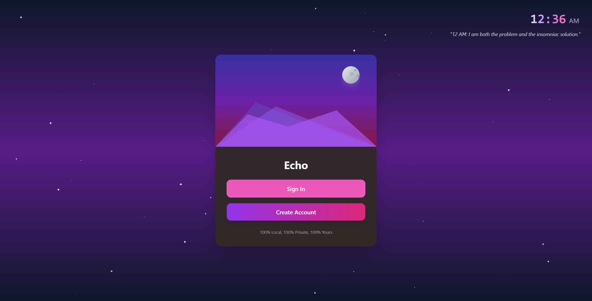

**Two main options:**
- **Sign In**: Access your existing account
- **Create Account**: Set up a new user profile

You can create multiple accounts for different purposes (work, personal, projects). Each account has completely separate data - your work thoughts stay separate from personal entries.

The tagline "100% Local, 100% Private, 100% Yours" explains Boo's core promise: everything runs on your device, no cloud storage.

---

## Sign In Options

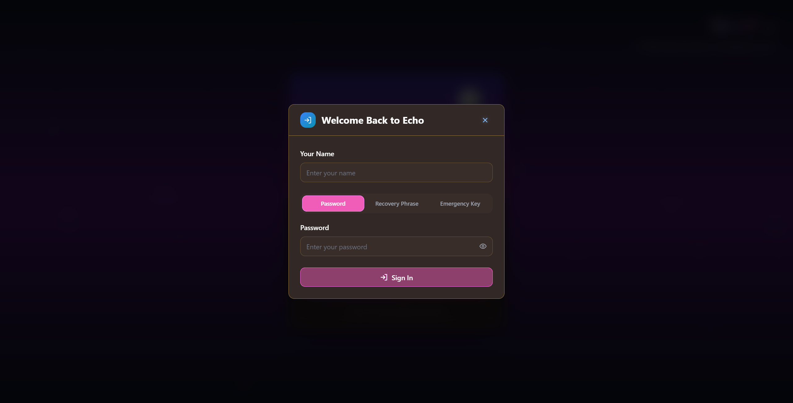

**Three ways to access your account:**
- **Password**: Your regular login method
- **Recovery Phrase**: Backup option if you forget your password
- **Emergency Key**: Final recovery method for account access

All three are created when you set up your account. Keep the recovery phrase and emergency key somewhere safe.

---

## Dashboard

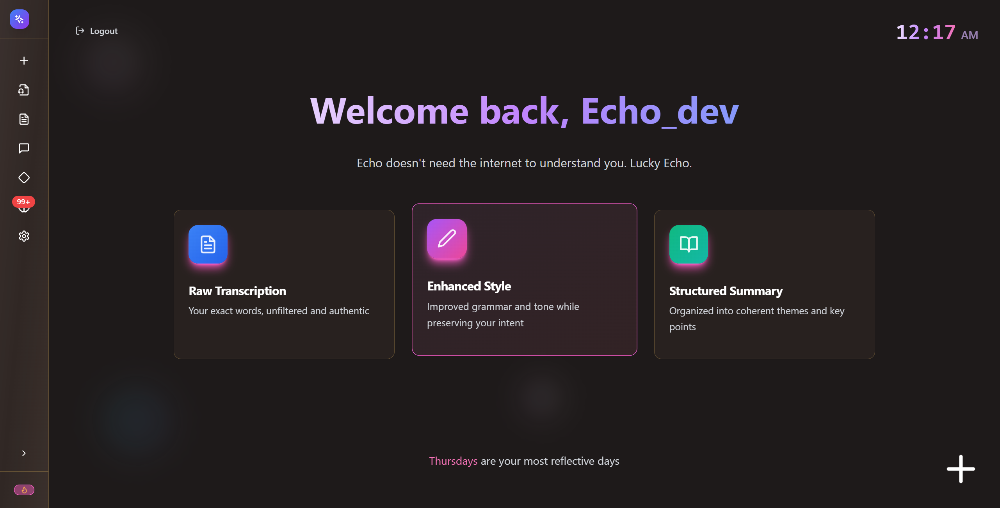

Your main hub shows:
- **Welcome message** with your username
- **Three processing options** for your journal entries:
  - Raw Transcription (your exact words)
  - Enhanced Style (improved grammar and flow)
  - Structured Summary (organized key points)
- **Rolling insights** about your journaling patterns
- **Navigation sidebar** on the left for all features

The sidebar gives you quick access to everything: new entries, voice upload, your entry library, chat with Boo, pattern analysis, memory review, and settings.

---

## Creating New Entries

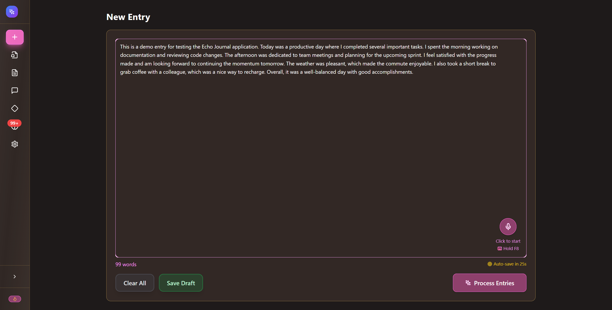

**Two ways to create entries:**
- **Type directly** in the text area
- **Press your hotkey** to record voice (default F8, configurable in settings)

The interface shows:
- Word count at the bottom
- Auto-save status (saves drafts automatically)
- "Process Entries" button to run AI analysis

After processing, you'll see three versions of your entry based on the processing modes from the dashboard.

---

## Your Entry Library

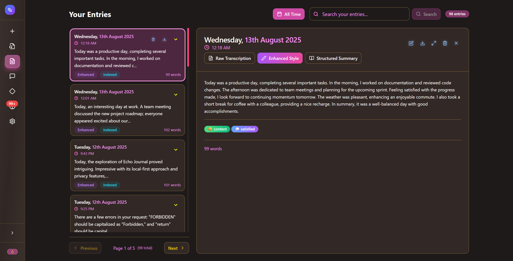

**Left side**: Chronological list of all your entries  
**Right side**: Full content of the selected entry

**Features:**
- Search bar to find specific entries
- Three tabs (Raw, Enhanced, Structured) to switch between versions
- Mood tags automatically detected by AI
- Entry metadata (date, time, word count)
- Edit, export, and delete options

Click any entry in the left list to view its full content on the right.

---

## Voice Upload

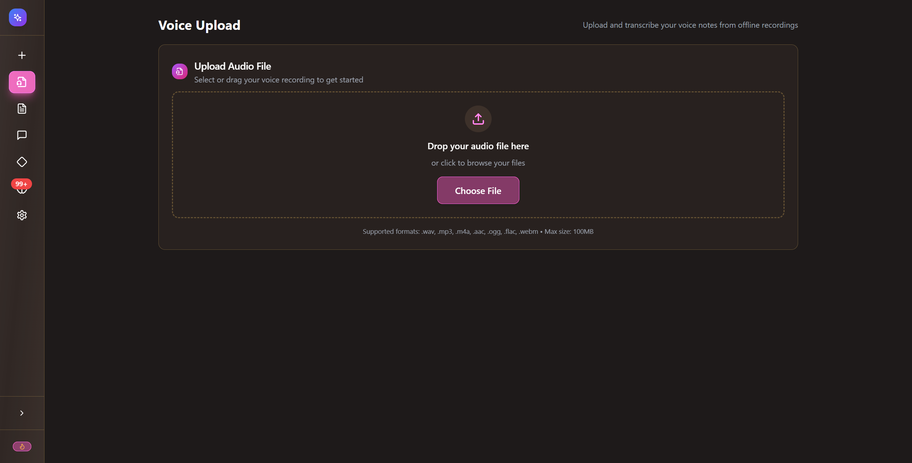

Upload audio files to transcribe and process them like regular entries.

**Supported formats**: .mp3, .wav, .m4a, .aac, .ogg, .flac, .webm  
**Max file size**: 100MB

After upload, Boo transcribes the audio and runs it through the same AI processing pipeline as typed entries. Useful for converting old voice memos into searchable journal entries.

---

## Pattern Insights

### Word Cloud
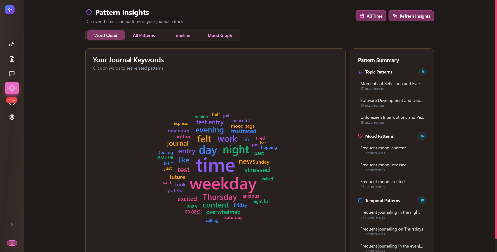

Shows frequently used words in your journal entries. Larger words appear more often in your writing.

### Mood Analysis
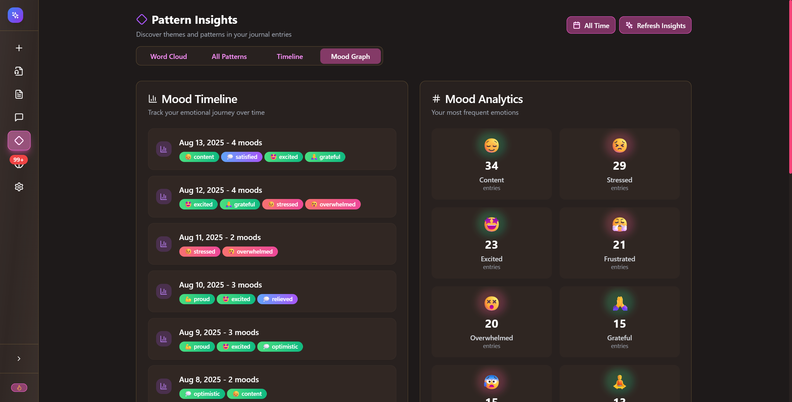

**Left side**: Timeline showing mood tags for each day  
**Right side**: Analytics showing your most frequent emotions with counts

Boo automatically detects mood from your entries and tracks patterns over time. Helps you notice emotional trends you might miss day-to-day.

---

## Talk to Boo

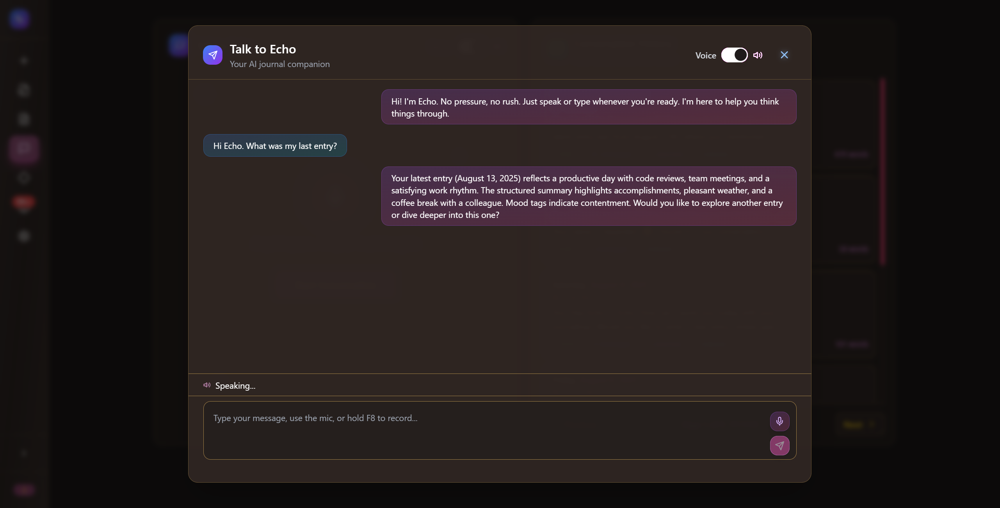

Chat interface where you can ask Boo anything:
- Questions about your journal entries: "What did I write about [topic] last week?"
- Entry searches: "Show me entries where I mentioned [person]"  
- Pattern analysis: "What patterns do you see in my work stress?"
- General questions: "Who created Linux?" or "Tell me a joke"

**Features:**
- Voice toggle (top right) to hear responses spoken aloud
- Conversation history on the left
- Message input supports typing or voice (configurable hotkey, default F8)

Boo searches through your entries to answer questions and can surface connections between different thoughts and time periods.

---

## Memory Review

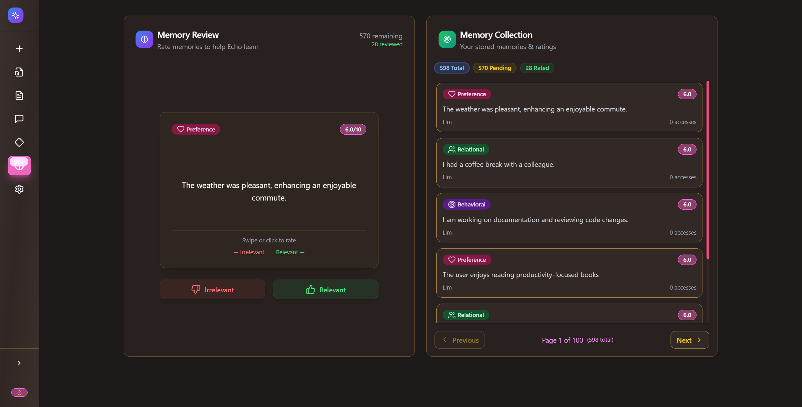

Boo automatically extracts memories from your entries - facts about your preferences, habits, and relationships. Rate these memories as relevant or irrelevant to help Boo learn what's important to you.

**Note**: This is a beta feature that can be enabled/disabled in Settings → Memory.

**Memory types:**
- Personal facts (job, location, basic info)
- Preferences (likes, dislikes, style choices)
- Behavioral patterns (routines, habits)
- Relationships (details about people you mention)

The number badge on the sidebar shows pending memories to review.

---

## Settings

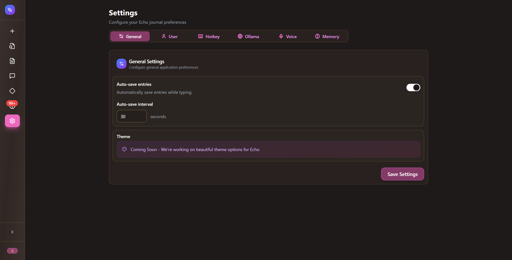

Configure Boo across several sections:
- **General**: Auto-save, theme preferences
- **User**: Account details, password changes
- **Hotkey**: Set global voice recording key (default F8)
- **Ollama**: Configure AI models and connection settings
- **Voice**: Text-to-speech options for Boo conversations
- **Memory**: Enable/disable automatic memory extraction

Most features work fine with default settings, but you can customize based on your preferences.

---

## Navigation Quick Reference

**Sidebar icons from top to bottom:**
- 🏠 **Home**: Dashboard and main insights
- ➕ **New Entry**: Create journal entries
- 🎤 **Voice Upload**: Upload and transcribe audio files
- 📄 **Entries**: Browse and search your journal library
- 💬 **Talk to Boo**: Chat with your AI about your entries
- 🔍 **Patterns**: View word clouds and mood analytics
- 🧠 **Memory Review**: Rate AI-extracted memories (shows count of pending reviews)
- ⚙️ **Settings**: Configure all options

**Global shortcuts:**
- **Hotkey (default F8)**: Record voice from anywhere in the app (configurable in settings)
- **Auto-save**: Drafts save automatically while typing

---

## Getting Started Tips

1. **Create your first entry** - type or record something to see how processing works  
2. **Try different processing modes** - see how Raw, Enhanced, and Structured versions differ  
3. **Ask Boo questions** - use the chat feature to search through your entries  
4. **Review memories regularly** - help Boo learn what information matters to you  
5. **Check pattern insights** - discover trends in your writing and mood  
6. **Set up multiple accounts** if you want separate spaces for work/personal use
